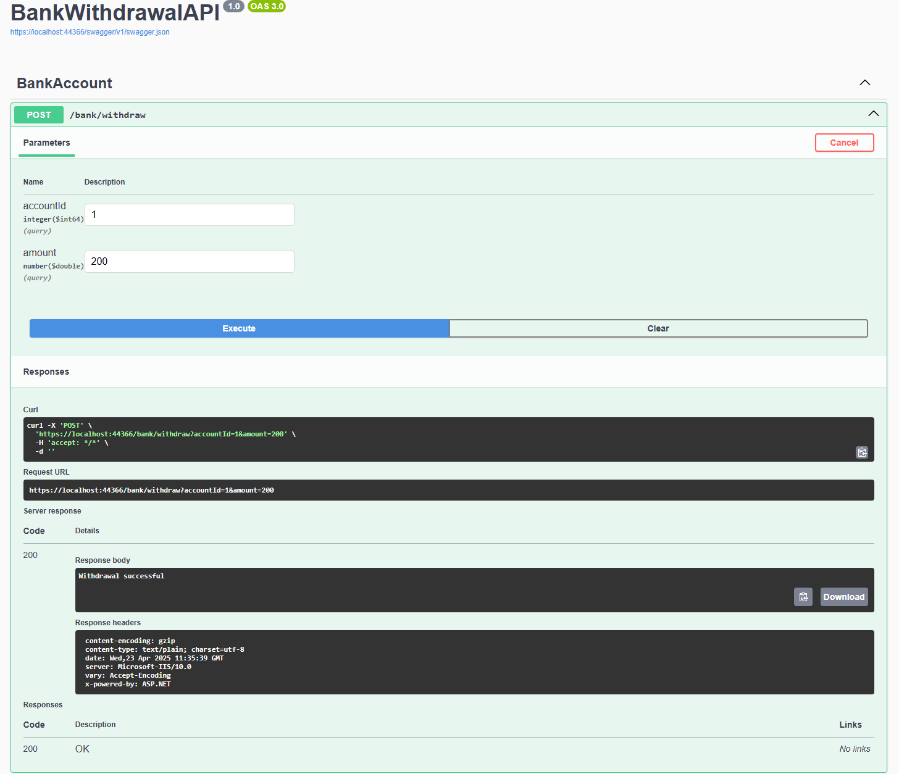

# Bank Withdrawal API

A clean and modular .NET 7 Web API simulating a bank account withdrawal process with event publishing.  
This project was built as part of a coding assessment.

---

## Business Functionality

The core business function is to allow a withdrawal from a bank account, ensuring:
- Sufficient funds are available
- Balance is updated accordingly
- An event is published to simulate AWS SNS behavior

---

## Architecture Overview

This project follows a simplified **Clean Architecture** approach:
```
Controller ➜ Service ➜ Repository + Event Publisher ➜ Model
```

- **Controller**: Handles HTTP requests
- **Service**: Contains business logic (withdrawal rules, flow control)
- **Repository**: Simulates database interactions (mocked in-memory)
- **Event Publisher**: Simulates publishing events to SNS
- **Models**: Represent domain entities (`Account`, `WithdrawalEvent`)

---

## Implementation Choices

- **C#** was chosen as the implementation language due to my fluency and confidence in building structured and testable applications in .NET.
- Used `decimal` for monetary values (equivalent to Java’s `BigDecimal`) for precision.
- **In-memory data store** used for simplicity and focus on logic rather than persistence.
- **Console logging** simulates AWS SNS publishing — easily replaceable with real AWS SDK integration if needed.
- **Dependency Injection** is used throughout for clean separation and testability.
- Controller returns plain status strings to mimic the original Java example while allowing for easy enhancement (status codes, DTOs, etc.).

---

## How to Run

1. Clone the repo:
  ```
    git clone https://github.com/ShanwillS/BankWithdrawalAPI.git
  ```
2. Open in Visual Studio 2022+ or VS Code

3. Run the project

4. Test the endpoint: POST http://localhost:5000/bank/withdraw?accountId=1&amount=100

---
## API Testing via Swagger

Swagger UI is enabled for this project to easily test the `/bank/withdraw` endpoint.

You can run the project and navigate to:
```
http://localhost:{your-port}/swagger
```
From there, you can simulate a withdrawal with parameters like:
```
accountId: 1 amount: 200
```
### Example:

---

## Notes on Language Preference
While I used C# for this exercise, I'm fully comfortable working in Java as well.
My goal was to demonstrate architectural thinking and clean code practices — transferable across languages.

Project Structure
```
/Models              -> Domain entities (Account, WithdrawalEvent)
 /Repositories       -> Data access abstraction & mock implementation
 /Services           -> Business logic layer
 /Events             -> Event publishing (SNS simulation)
 /Controllers        -> API routing
 Program.cs          -> DI setup and application entry point
```

## Unclear Library Usage
The only external library added was:

- `Swashbuckle.AspNetCore`: Used to enable Swagger UI for API testing and demonstration.

All other functionality relies on built-in .NET libraries.

## Testing
Per the assessment, formal unit/integration testing was out of scope — however, this architecture is fully testable and can easily support:

- Unit tests for services
- Mocked repositories and event publishers
- Integration tests for controllers

## Thanks
Thanks for reviewing! If you have any questions or want to see this reimplemented in Java, I’m happy to oblige.

---

###
